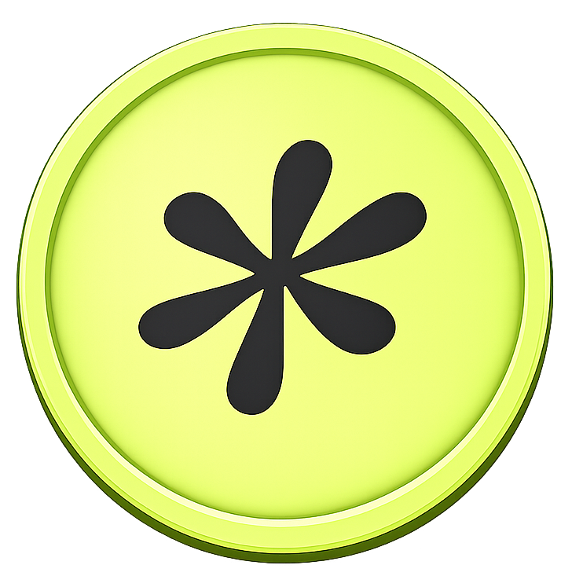

<p align="center">
   <div style="display: flex; align-items: center; gap: 10px;">
  
  <h1>BLOCKS</h1>
 </div>
  
</p>


<p align="center">
  <strong>Premium, open-source UI components for modern web applications.</strong>
  <br>
  <strong>Ship premium landing pages faster.</strong>
</p>

<p align="center">
  <a href="#quickstart"><strong>Quickstart</strong></a> &middot;
  <a href="https://paperclip.ing/docs"><strong>Docs</strong></a> &middot;
  <a href="https://github.com/Ethan4582/T7blocks"><strong>GitHub</strong></a> &middot;
  <a href="https://demo.t7blocks.xyz/gallery"><strong>Demo</strong></a>
</p>


<p align="center">
  <a href="https://github.com/paperclipai/paperclip/blob/master/LICENSE"></a>
  <a href="https://github.com/Ethan4582/T7blocks/stargazers"></a>
 
</p>
---
# T7blocks


T7blocks is a component library built for developers who want their interfaces to feel like high-end Framer templates — without the Framer price tag. Every block is crafted with custom GSAP and Framer Motion animation logic, the kind you see on top-tier product pages and agency sites.

This is not your typical UI library. No generic buttons. No plain modals. Every component is designed to elevate.

---

## What's inside

**Components** — Animated UI blocks built for modern landing pages. Magnetic buttons, scroll-triggered reveals, smooth transitions.

**Hero Sections** — Full hero layouts with cinematic entrances, gradient overlays, and motion that sets the tone immediately.

**Background Effects** — Particle fields, noise textures, mesh gradients, and generative canvas effects for immersive page backgrounds.

**Landing Page Templates** — Full page compositions assembled from T7blocks components. Copy the structure, own the code, ship in hours.

---

## Who it's for

Developers who are tired of building the same polished animations from scratch for every project. If you know how to code but want the design and motion quality of a $500 Framer template — this is built for you.

---

## Installation

```bash
npm install @t7blocks/ui
```

Most components have peer dependencies. Each component page lists exactly what to install.

---

## CLI — Own the source

```bash
npx @t7blocks/cli add button-1
```

Downloads the raw `.tsx` source directly into your project. No wrappers, no black-box imports — just the code, ready to customize.

---

## Free vs Pro

| | Free | Pro |
|---|---|---|
| Animated components | ✓ | ✓ |
| Hero sections | Preview only | ✓ Full source |
| Background effects | Selected | ✓ All |
| Landing page templates | — | ✓ |
| CLI access | Free components | ✓ All components |
| npm package | ✓ | ✓ |

Pro members get full source access, CLI downloads, and early access to new blocks at **[t7blocks.xyz](https://t7blocks.xyz)**.

---

## Tech

- React 18+
- TypeScript
- GSAP
- Framer Motion
- Lenis (smooth scroll)

Components are framework-agnostic at the output level — they work in Next.js, Vite, Remix, or any React setup.

---

## Documentation

Full component docs, live demos, and props reference at **[t7blocks.xyz](https://t7blocks.xyz)**.

---

## License

Copyright © 2025 Ashirwad Singh. Free components are available for personal and commercial use. Redistribution as a standalone library or template kit is not permitted.

Full terms → [LICENSE](https://github.com/Ethan4582/t7block-free/blob/master/LICENSE)